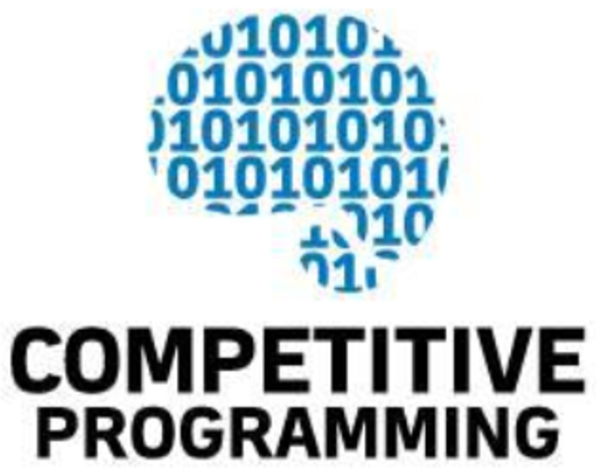

# CSC 232 - Fall 2023
Nadeem Abdul Hamid

Image credit: https://kkdubey94310.medium.com/beginners-guide-to-competitive-programming-ea287e1fb49c

<!-- paginate: skip -->
<!-- _class: lead -->

---

---
# What is Competitive Programming?

Given a concrete problem statement:

- analyze the problem and determining what algorithm can solve it
- identify possible pitfalls and corner cases
- quickly produce an implementation that passes test cases

    > sport of the mind

---
# Benefits

- Improved problem solving skills
- Improved practical knowledge of algorithms
|
- Write more optimized code
- Write less buggy code
|
- Great practice for technical interviews
- Have fun, win prizes and glory

---

# Competitions vs. Industry

- Severe time pressure
    - no time for unit tests
    - no time to write documentation
- Style and code quality doesn’t matter*
- Maintainability doesn’t matter
- Problems self-contained

https://en.wikipedia.org/wiki/Programming_in_the_large_and_programming_in_the_small

https://en.wikipedia.org/wiki/Competitive_programming#Benefits_and_criticism 

---
# Goals for this course

- A challenging, self-motivating course to experience what makes programming fun and exciting

- Strengthen algorithmic intuition and practical problem-solving skills

- Prepare to join a team to a regional programming contest (not required)

---
# Syllabus & Plan for this semester

- Textbook
- Policies
    - Generative AI and internet sites

- Software setup
    - Programming language - Python  (or Java)
    - Visual Studio Code

---
# Let’s go!

- [In class](../in-class.md)

- Assignments linked on Canvas
    - Solved Problem [SP]
    - Find the Bug [FTB]

